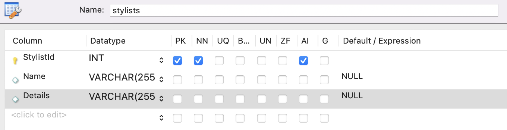
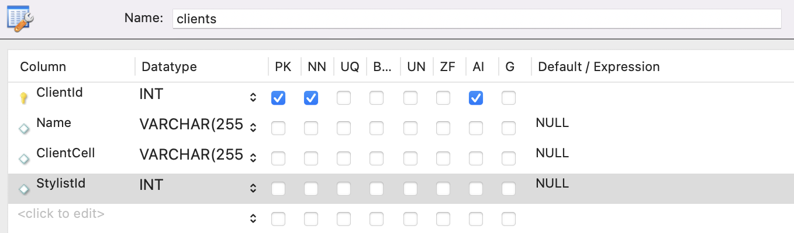

# Claire's Salon

### Contributors
* Athea DeLing

### Description
This application allows for the salon owner to see a list of current stylists and to add new stylists. The owner is able to click on a specific stylist and see what clients they have. The owner is also able to add new clients to specific stylists.

### Technologies Used
* C#
* .NET 6 SDK
* SQL
* HTML
* CSS

### Setup Instructions
#### Database Setup
1. Instal MySQL, to do so follow these [instructions](https://www.learnhowtoprogram.com/c-and-net/getting-started-with-c/installing-and-configuring-mysql)
2. Once installed follow these [instructions]() to set up your database
3. You will name your  firstname_lastname with your actual first and last name
4. Within this database you will create two tables one labeled Stylists and the other Clients. Here is what they should look like





#### Running the Program
1. You will fork the repository to you personal github
2. From there you will clone it on to you personal computer
3. Once cloned you will want to navigate to HairSalon
4. Once in the terminal for HairSalon you will want to run **dotnet restore** and **dotnet run build**. From there you will run two more commands **dotnet add package Microsoft.EntityFrameworkCore -v 6.0.0** and **dotnet add package Pomelo.EntityFrameworkCore.MySql -v 6.0.0**.
5. When you are done running all those commands you will want to add a new file to HairSalon called appsetting.json, once the file is created you will add this code

```jason
{
  "ConnectionStrings": {
      "DefaultConnection": "Server=localhost;Port=3306;database=firstname_lastname;uid=[uid];pwd=[pwd];"
  }
}
```

6. You will replace the firstname_lastname with the name of the table you previously created. When setting up your MySQL you should have created a user id and password that you will put in place of the **uid** and **pwd**
7. Once that is all completed in the terminal you then run **dotnet watch run** this will run the application and you should now be able to use it

### Known Bugs
* No known bugs currently

### License
[GNU GPL 3.0](https://choosealicense.com/licenses/gpl-3.0/) Copyright (c) 12/30/2022 Athea DeLing